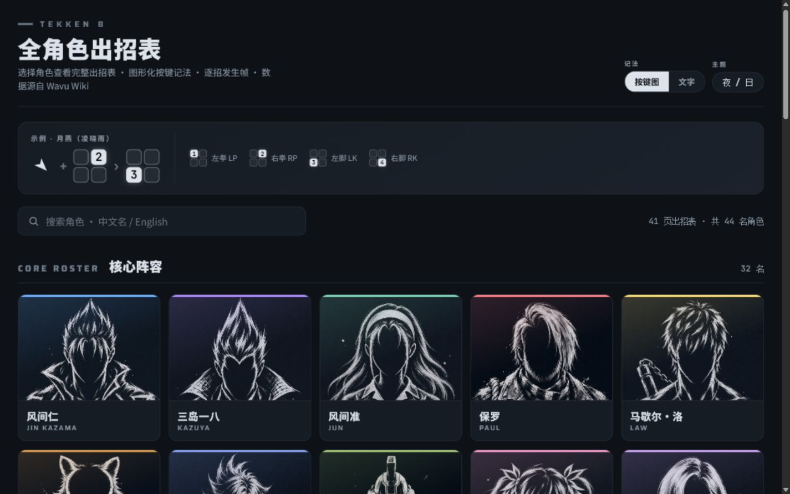

# TEKKEN 8 Chinese Movelist Hub

An exhibition-style, screen-first reference for TEKKEN 8 movelists in Simplified Chinese. Pick a character and browse commands, startup frames, stances, throws, heat moves, and sample combos in a fast, self-contained static page.

[Open the live site](https://ludengz.github.io/tekken8movelist/) · [Browse the structured data](tools/source/) · [Read the build guide](CLAUDE.md)



## Highlights

- 41 character movelist pages across the base roster and Seasons 1–3
- Graphical input notation with text and direction-only alternatives
- Dark and light themes with saved browser preferences
- Startup-frame references and Chinese move-name interpretations
- Responsive, dependency-free HTML that runs directly on GitHub Pages
- Reproducible page generation and browser-level regression checks

## Run locally

The published site is already built. Serve the repository root with any static file server:

```powershell
python -m http.server 3000 --directory docs
```

Then open `http://localhost:3000/`.

To rebuild generated pages and run the complete validation gate:

```powershell
pwsh -File tools\validate_season2.ps1
```

## Repository layout

- `docs/index.html` — character-select homepage and GitHub Pages entry point
- `docs/*_tk8_movelist.html` — self-contained character pages
- `docs/avatars/` and `docs/avatars-light/` — dark- and light-theme character portraits
- `design/notation-wireframe/` — source reference for the shared input-notation component
- `tools/source/` — structured movelist, translation, and combo snapshots
- `tools/build_season2.py` — reproducible page generator
- `tools/validate_season2.ps1` — build, regression, and browser QA entry point
- `tools/KNOWLEDGE.md` — project-specific data and rendering constraints

## Attribution and project status

Movelist data is compiled from [Wavu Wiki](https://wavu.wiki/). Chinese move names are unofficial reference interpretations. Character portraits are unofficial generative-AI outline-style interpretations created for this project.

This is a non-commercial fan project for personal study, research, and discussion. It is not affiliated with, sponsored by, or endorsed by Bandai Namco Entertainment Inc. TEKKEN™ 8 and its characters, names, trademarks, and original designs belong to Bandai Namco Entertainment Inc. and their respective rights holders.

---

## 中文说明

这是一个面向屏幕阅读的《铁拳 8》简体中文全角色出招表网站，提供图形化按键、发生帧、架势、投技、热能招式与示例连招，并支持深浅主题和多种记法切换。

[访问在线网站](https://ludengz.github.io/tekken8movelist/) · [查看结构化数据](tools/source/) · [阅读构建说明](CLAUDE.md)

本项目为非商业性质的非官方同人项目，仅供个人学习、研究与交流。招式数据整理自 Wavu Wiki，中文招式名为非官方意译；角色头像为本项目使用生成式 AI 制作的非官方轮廓风格演绎。本项目与 Bandai Namco Entertainment Inc. 无隶属关系，亦未获其赞助或认可。
