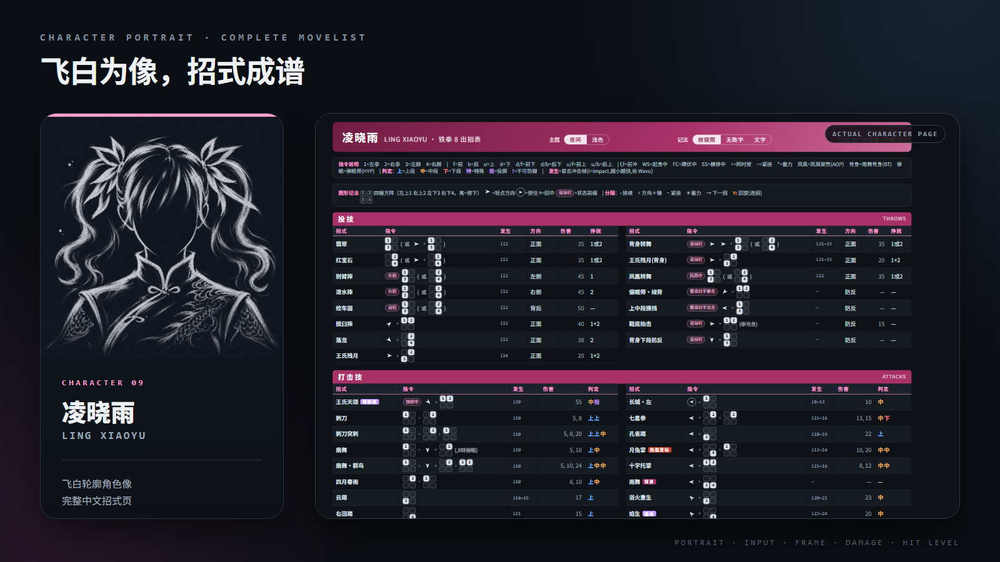
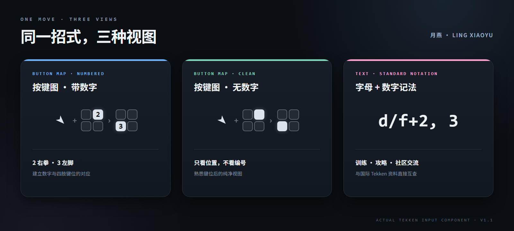
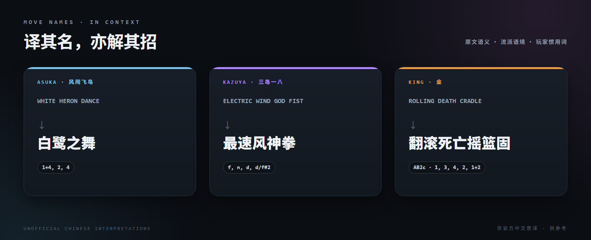

<div align="center">

# TEKKEN 8 全角色中文出招表

### 看懂招式，也看懂怎么按。

**高质量中文招式名 · 图形化四键映射 · 三种记法一键切换**

[**进入全角色出招表 →**](https://tekken8movelist.github.io/)

<sub>当前已发布 41 份角色出招表</sub>

</div>




以飞白轮廓识别角色；进入后，完整招式、按键、发生帧、判定与伤害在一页展开。



带数字认键位，无数字看位置，`d/f+2, 3` 对照训练模式与社区资料。三种视图一键切换，偏好自动保留。



招式名结合原文语义、武术语境与作品既有译名逐招整理，并明确标注为非官方中文意译。

## 一页看全，直接开练

**完整招式** · **发生帧** · **判定与伤害** · **架势** · **投技** · **Heat 招式** · **示例连招**

无需安装，手机与桌面浏览器都能直接打开；深浅主题与记法偏好会跨角色保留。

<div align="center">

[**选择你的角色 →**](https://tekken8movelist.github.io/)

<sub>Crafted by Ludeng Zhao · with Claude Code + OpenAI Codex</sub>

</div>

<details>
<summary><strong>开发与验证</strong></summary>

站点为可直接部署到 GitHub Pages 的静态 HTML。结构化招式与翻译数据位于 [`tools/source/`](tools/source/)；Codex 项目约束见 [`AGENTS.md`](AGENTS.md)，生成管线与构建说明见 [`CLAUDE.md`](CLAUDE.md)。

```powershell
python -m http.server 3000 --directory docs
pwsh -File tools\validate_season2.ps1
```

</details>

## English

A Chinese-first TEKKEN 8 reference built for fast practice: 41 published character pages, contextual Chinese move-name translations, graphical four-button input maps, switchable numbered, number-free, and standard text notation, plus frame data, throws, stances, Heat moves, and sample combos.

[**Open the live movelist →**](https://tekken8movelist.github.io/)

## 来源与声明 / Credits

招式数据整理自 [Wavu Wiki](https://wavu.wiki/)。中文招式名为非官方意译；角色头像为本项目使用生成式 AI 制作的非官方轮廓风格演绎。

本项目为非商业性质的非官方同人项目，仅供个人学习、研究与交流；与 Bandai Namco Entertainment Inc. 无隶属关系，亦未获其赞助或认可。TEKKEN™ 8 及其角色、名称、商标与原始设计的相关权利归 Bandai Namco Entertainment Inc. 及其他相应权利人所有。

Movelist data is compiled from [Wavu Wiki](https://wavu.wiki/). Chinese move names are unofficial reference interpretations. Character portraits are unofficial generative-AI outline-style interpretations created for this project.

This is a non-commercial, unofficial fan project for personal study, research, and discussion. It is not affiliated with, sponsored by, or endorsed by Bandai Namco Entertainment Inc. TEKKEN™ 8 and its characters, names, trademarks, and original designs belong to Bandai Namco Entertainment Inc. and their respective rights holders.
